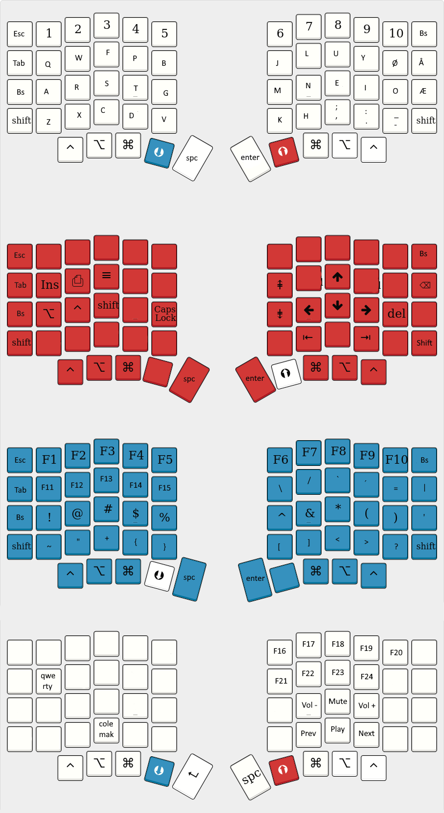

# My Sofle Keymap - Simplified
This keymap is made for use with Norwegian keymap in the OS. The goal is something like this.

The left rotary encoder controls the volume and the right encoder skips or rewinds tracks. 

The default main layer is based on Colemak Mod-DH, but modified to add ÆØÅ. The lower layer is changed to accommodate the special characters that are moved or lost due to the extra letters and Norwegian layout. Backspace is also added to where capslock is normally, as is popular in Colemak layouts.

There is a QWERTY layer can be set with the options on the last layer and the display will show which keymap is active.

I have also removed the reset button in favour of bootmagic lite. The bootmagic lite buttons are set to ESC on left hand and Backspace on right hand.

## Changes from main
This is branch removes the Windows/Mac option and makes the default layer not persistent in order to greatly simplify the code.

I've also added a workaround to eliminate dead keys.

Space and enter is swapped to be more suited for gaming.